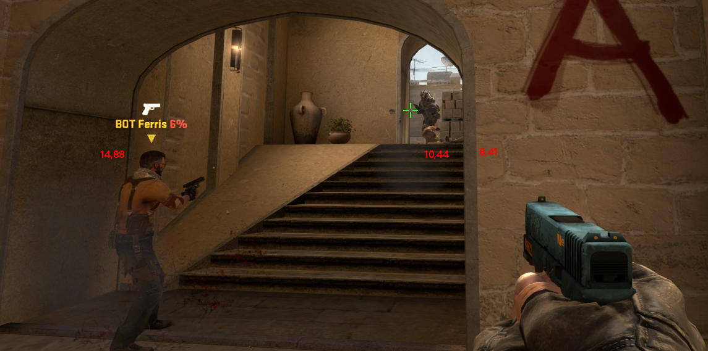
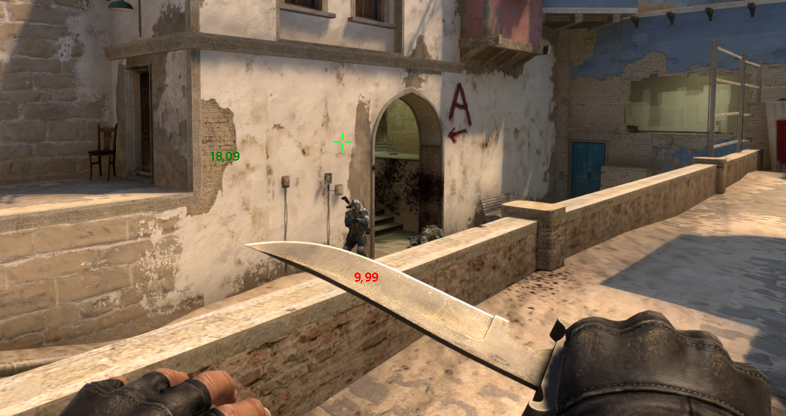

# CS:GO Wallhack

A simple counter strike global offensive wallhack that display the distance of the enemy from you.




This is an external hack that does **not** inject and/or modify any game file or game memory.

## Usage

- Open CS:GO.
- Connect to a server or create a game.
- Run the project from CGRedSoft folder.
- Click in button to Enable the hack.

By default the distance label is positioned in the enemy feet, you can also change its position in the main hack interface.

**Distance colors are based in the enemy distance**
- Red: close range.
- Green: medium range.
- Beige: far away range.
- Purple: Inactive last enemy position in the memory.

## Build

- This project runs with .NET Framework 4.5
- You **must** compile it using x86

## Warning

You can **try** avoid get banned changing this source code adding some random codes around the project so you can change them and recompile it everytime you play a new game.

This hack comes as is with no guarantees regarding its safety with VAC system.

This is a cheat and you might get banned if you use it on any protected servers, so use at your own risk.

___

## CS:GO Memory Dumper - Hack Updater

When CS:GO updates, most times the addresses used to get the data to make the hack works change.

This project will scan the game memory looking for some patterns to get the new addresses, those patterns configs are in the `patternConfig.json` file and contains the current necessary addresses the project needs.

#### Pattern Config file structure

```json
{
    "name": "EntityList",
    "extraBytes": 0,
    "patternOffset": 1,
    "pattern": "BB, ?, ?, ?, ?, 83, FF, 01, 0F, 8C, ?, ?, ?, ?, 3B, F8"
}
```

- Name: The pattern name.
- Extra Bytes: Total of extra bytes to be added to the final memory found.
- Pattern Offset: Offset to be added into the Pattern found.
- Pattern: The pattern to be search. The "?" caracter will be ignored in the search.

### Usage

- Open CS:GO
- Move `patternConfig.json` file to the same folder of this project executable.
- Run the project from CSGOMemoryDumper folder.

### Build

- This project runs with .NET Core 3.1
- You **must** compile it using x86

___

### Contributing

Feel free to submit a PR or open an issue :)

___

### License

- GNU GPLv3 - GNU General Public License v3.0